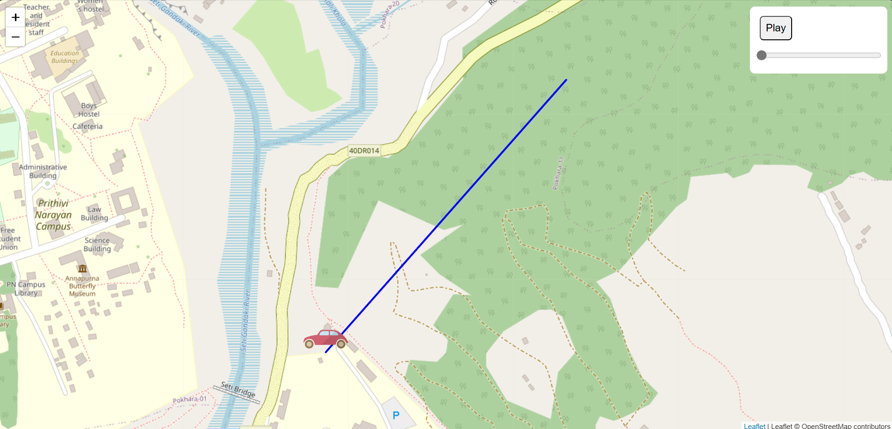

# Vehicle Tracker


## Description 


* This project provides a vehicle tracking system with a frontend that displays real-time vehicle movement on a map using Leaflet.js and a backend that provides route data. The frontend is deployed on GitHub Pages, and the Node.js backend is deployed on Github.

## Table of Contents

- [Installation](#installation)
- [Technology Used](#technology-used)
- [Dependencies](#dependencies)
- [Feature](#feature)

## Installation 
```bash
cd car-tracker
mkdir tracker-app
```

```bash
npm install
npm install --save leaflet-routing-machine
```

# Start the server
```bash
npm start
```
# Start the server in development mode with nodemon
```bash
npm run dev
```

# Configure

* PORT=3000

## Technology Used

* Frontend: HTML, CSS, JavaScript, Leaflet.js
* Backend: Node.js, Express.js
* Map: OpenStreetMap via Leaflet.js
* Deployment: GitHub Pages (Frontend)

## Feature

* Display real-time vehicle tracking on a map using Leaflet.js.
* Dynamic route panel with start and end points.
* Smooth timeline-based vehicle movement with play and pause functionality.
* Backend API to provide vehicle movement data.

1. Clone the repository:
 ```bash
   git clone https://github.com/AviralTechie/Maptracker.git
```
 

Feel free to customize and expand the sections as needed to fit your project specifics. This structure ensures that all necessary information and code are included in a clear and organized manner.


